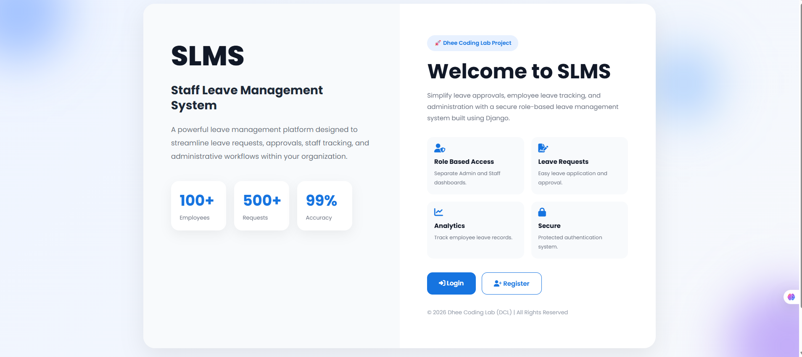
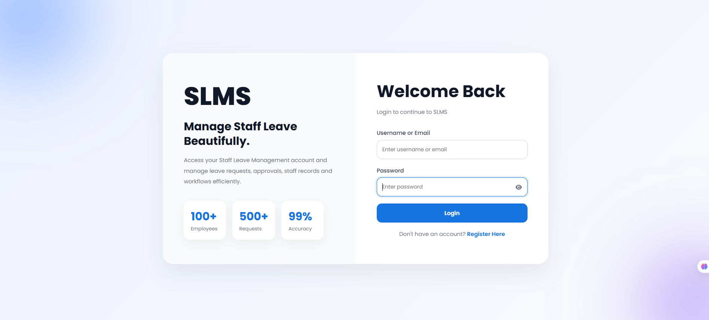
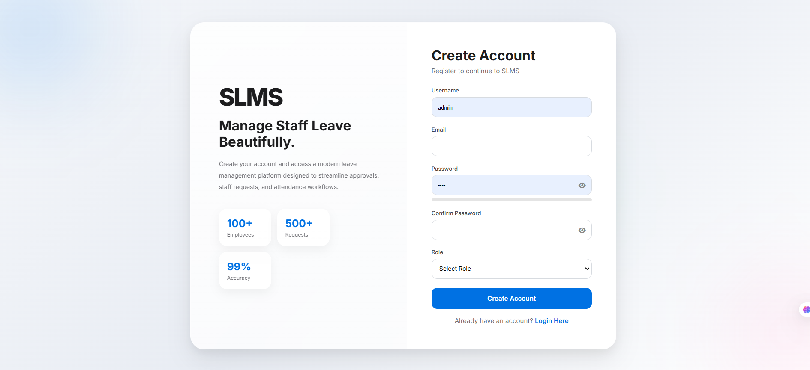
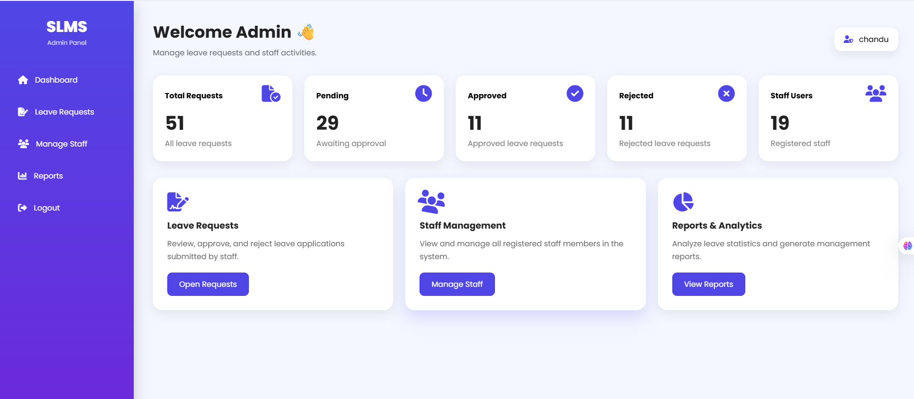
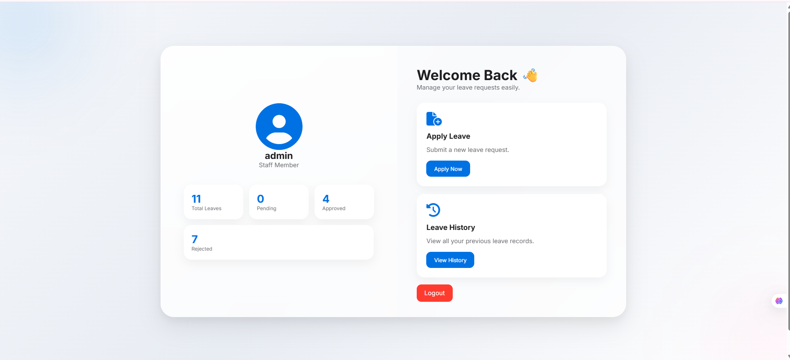
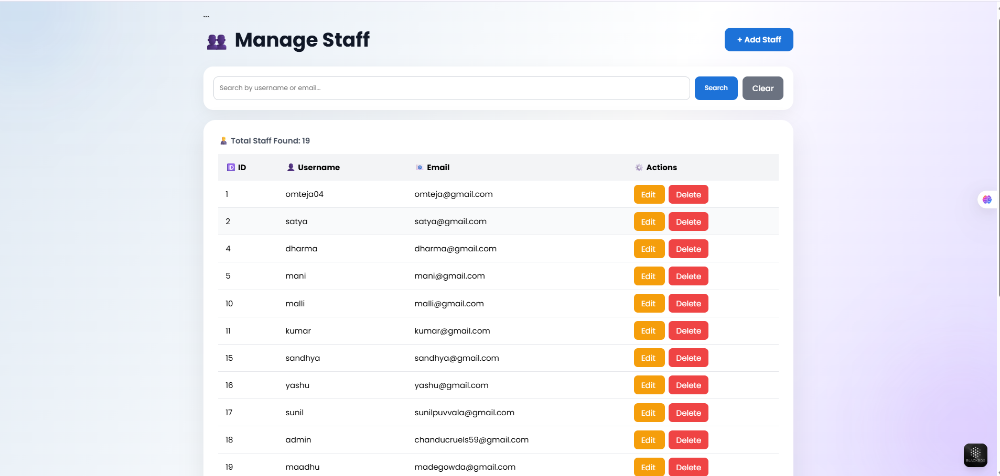
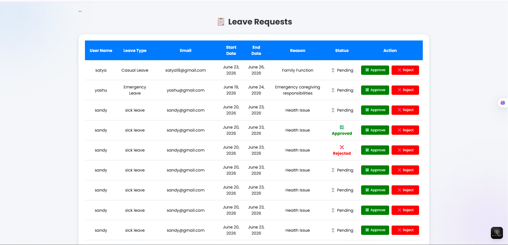
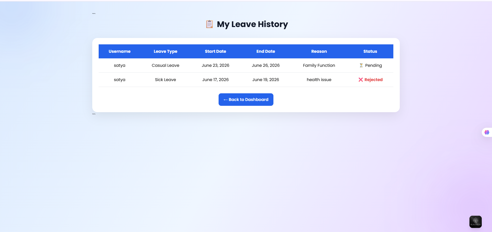
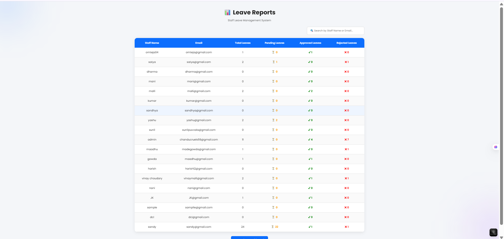

# 🚀 Staff Leave Management System (SLMS)


## 📌 Project Overview

The **Staff Leave Management System (SLMS)** is a web-based application developed using **Python and Django** to automate and simplify the leave management process within an organization. The system enables staff members to apply for leaves, monitor application status, and manage leave history, while administrators can efficiently review, approve, reject, and track leave requests.

This project demonstrates the implementation of modern web development practices, including **Django ORM**, **authentication and authorization**, **role-based access control**, **CRUD operations**, and **software testing**.

---

## 🎯 Objectives

* Digitize leave management processes.
* Reduce paperwork and manual tracking.
* Improve transparency in leave approvals.
* Provide centralized leave monitoring.
* Enhance organizational productivity.

---

## ✨ Features

### 👨‍💼 Admin Module

* Secure Login Authentication
* Dashboard with Leave Statistics
* Manage Staff Accounts
* View All Leave Applications
* Approve Leave Requests
* Reject Leave Requests
* Leave Report Generation
* Staff Leave Analytics
* Leave Status Tracking
* Manage Employee Profiles

### 👨‍💻 Staff Module

* Secure Login
* Apply for Leave
* View Leave History
* Track Leave Status
* Update Personal Profile
* Receive Leave Approval/Rejection Updates

---

## 🛠️ Technologies Used

### Backend

* Python
* Django Framework

### Frontend

* HTML5
* CSS3
* JavaScript
* Bootstrap

### Database

* SQLite

### ORM

* Django ORM (Object Relational Mapping)

### Testing

* Django Test Framework
* Unit Testing
* Integration Testing

---

## 🏗️ Core Concepts Implemented

### Django MVT Architecture

* Model
* View
* Template

### Database Management

* Django ORM
* Model Relationships
* QuerySets
* Migrations

### Authentication & Authorization

* User Authentication
* Login/Logout
* Password Security
* Role-Based Access Control

### CRUD Operations

* Create Staff
* Read Staff Information
* Update Staff Details
* Delete Staff Records

### Other Concepts

* Session Management
* URL Routing
* Form Validation
* Middleware Processing
* Responsive Web Design
* Template Rendering

---

## 🗄️ Database Models

### 1. User Model

Django's built-in User model is used for:

* Authentication
* Username Management
* Password Security
* Email Management

### 2. Profile Model

Stores additional information about users:

```python
class Profile(models.Model):
    user = models.OneToOneField(User, on_delete=models.CASCADE)
    role = models.CharField(max_length=20)
```

Responsibilities:

* User Role Management
* Staff Information Storage
* Admin/Staff Identification

### 3. Leave Model

Stores leave requests submitted by staff.

```python
class Leave(models.Model):
    username = models.ForeignKey(User, on_delete=models.CASCADE)
    leave_type = models.CharField(max_length=50)
    start_date = models.DateField()
    end_date = models.DateField()
    reason = models.TextField()
    status = models.CharField(max_length=20)
```

Responsibilities:

* Leave Request Management
* Leave Approval Tracking
* Leave History Storage

### Django ORM Relationships

```text
User
 │
 └── OneToOne
      │
   Profile

User
 │
 └── OneToMany
       │
      Leave
```

---

## 📂 Project Structure

```text
SLMS/
│
├── accounts/
│   ├── migrations/
│   ├── templates/
│   ├── models.py
│   ├── views.py
│   ├── urls.py
│   ├── forms.py
│   └── tests.py
│
├── leaves/
│   ├── migrations/
│   ├── templates/
│   ├── models.py
│   ├── views.py
│   ├── urls.py
│   ├── forms.py
│   └── tests.py
│
├── static/
│   ├── css/
│   ├── js/
│   └── images/
│
├── templates/
│
├── slms/
│   ├── settings.py
│   ├── urls.py
│   ├── wsgi.py
│   └── asgi.py
│
├── db.sqlite3
├── manage.py
├── requirements.txt
└── README.md
```

---

## ⚙️ Installation Guide

### 1️⃣ Clone the Repository

```bash
git clone https://github.com/your-username/slms.git
cd slms
```

### 2️⃣ Create Virtual Environment

```bash
python -m venv venv
```

### 3️⃣ Activate Virtual Environment

#### Windows

```bash
venv\Scripts\activate
```

#### Linux / Mac

```bash
source venv/bin/activate
```

### 4️⃣ Install Dependencies

```bash
pip install -r requirements.txt
```

### 5️⃣ Apply Migrations

```bash
python manage.py makemigrations
python manage.py migrate
```

### 6️⃣ Create Superuser

```bash
python manage.py createsuperuser
```

### 7️⃣ Run Development Server

```bash
python manage.py runserver
```

Visit:

```text
http://127.0.0.1:8000/
```

---

## 🧪 Testing

The project includes comprehensive testing to ensure reliability and correctness.

### Unit Testing

Tests individual components such as:

* Models
* Views
* Forms
* Utilities

### Integration Testing

Tests interactions between:

* Database
* Views
* Authentication System
* Leave Workflow

### Validation Testing

* Form Validation
* Input Validation
* Data Integrity Checks

### Authentication Testing

* Login Functionality
* Logout Functionality
* Access Restrictions
* Role-Based Permissions

### CRUD Testing

* Create Operations
* Read Operations
* Update Operations
* Delete Operations

Run tests using:

```bash
python manage.py test
```

---

## 📸 Screenshots

### 🏠 Home Page


### 🔐 Login Page


### 📝 Register Page


### 👨‍💼 Admin Dashboard


### 👨‍💻 Staff Dashboard


### 👥 Manage Staff


### 📋 Leave Requests


### 📜 Leave History


### 📊 Leave Reports


---

## 🔄 Leave Workflow


## 🚀 Future Enhancements

* Email Notifications
* Leave Balance Tracking
* PDF Report Generation
* Excel Report Export
* REST API Development
* Mobile Application Support
* Multi-Level Approval Workflow
* Cloud Deployment (AWS/Azure)
* Department-wise Analytics
* Attendance Integration

---

## 📚 Learning Outcomes

This project demonstrates practical knowledge of:

### Backend Development

* Python Programming
* Django Framework
* API Design Concepts
* Business Logic Implementation

### Database Management

* SQLite Database
* Django ORM
* Database Relationships
* Query Optimization

### Authentication & Security

* User Authentication
* Authorization
* Session Handling
* Secure Access Control

### Software Testing

* Unit Testing
* Integration Testing
* Validation Testing
* Functional Testing

### Full Stack Development

* Frontend Development
* Backend Development
* Database Integration
* Deployment Readiness

---

## 💼 Resume Highlights

✔ Developed a role-based Staff Leave Management System using Django.

✔ Implemented secure authentication and authorization mechanisms.

✔ Utilized Django ORM for efficient database operations and relationship management.

✔ Designed responsive user interfaces using HTML, CSS, JavaScript, and Bootstrap.

✔ Performed unit and integration testing to ensure application reliability.

✔ Built complete CRUD functionality for employee and leave management.

---

## 👨‍💻 Author

**Abbireddy Venkata Chandu**

Software Developer | Python Developer | Django Developer

---

## ⭐ Support

If you found this project helpful, consider giving it a ⭐ on GitHub.

**Happy Coding! 🚀**
